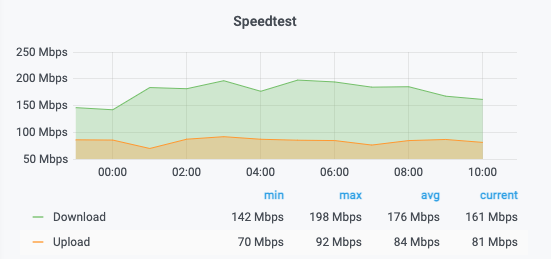

# python-speedtest-influxdb-grafana

This is a python script to gather speedtest information, write it to an Influxdb database and show the results in a Grafana panel. 

Requirements:

* Python 3

Required python3-pip packages:

* speedtest-cli
* influxdb

### Procedure

**1. create a new database in influxdb**

```
$ influx
> CREATE DATABASE mydb
```

**2. edit your influxdb settings**

```
DB_HOST = "1.2.3.4"
DB_PORT = "8086"
DB_USER = "mydb-user"
DB_PASSWORD = "VerySecurePassword"
DB_NAME = "mydb"
```

-> make sure that the correct ```speedtest-cli``` path (line 13) is used!

**3. run the script periodically (e.g. cron)**

```
*/30 * * * * python3 /speedtest.py
```

**4. use the following grafana panel**

[panel.json](panel.json)

